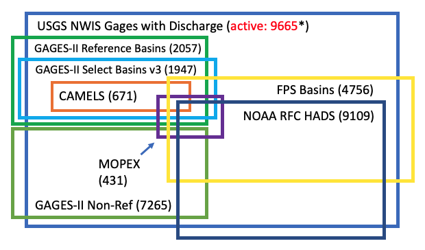

### Introduction

There are many different river basin data collections that have been used for hydrologic
monitoring or modeling studies. Many have been created by federal agencies like the USGS,
NOAA, EPA, and USDA.  Some have been created in connection with NSF-funded projects like
the CZOs (Critical Zone Observatories), LTER (Long-Term Ecological Research) and NEON
(National Ecological Observatory Network).  Yet others, usually subsets of the federal
agency collections, have been created to support other modeling objectives (e.g., MOPEX
and CAMELS).  Sometimes a federal agency creates a new collection to supersede an existing
collection.  Several of these collections are briefly summarized in a separate section below.
As might be expected, each of these data collections provide a different set of basin
attributes, usually in the form of CSV or TSV files (comma or tab separated values), and
sometimes also with ESRI shapefiles for all the basins in the collection. 
Unfortunately, there is a huge amount of heterogeneity across these basin collections, such
as different attributes, different column headings/abbreviations for the same attributes,
different measurement units, different methods of organizing files by region, and missing
data.  While some data sets are available on nice websites or through APIs, it can be
surprisingly difficult to obtain some of these collections, especially the older ones,
which may no longer be available at their original URL (e.g., MOPEX).  It is also unclear
to most potential users how these various basin collections relate to one another, or the
extent to which they contain the same basins, and the sea of acronyms is daunting.
A given basin, associated with a given stream gauge at its outlet, typically has many
different IDs, such as a USGS 8-to-15-digit ID, a 5-character NOAA NWS location ID,
a GOES satellite ID, and so on.

In order to address some of these issues, many of these data sets were acquired and then
a set of Python utilities were developed, one set for each data collection, to help with
collating, cleaning, augmenting, and extracting information from them.  These Python
utilities currently reside in a folder within the TopoFlow 3.6 repo, at:  
https://github.com/peckhams/topoflow36/tree/master/topoflow/utils/ngen  
and make use of some of the TopoFlow utilities.  This ngen folder contains Python source
code files with names like:   
<b>camels_utils.py</b>, <b>mopex_utils.py</b>, <b>gages2_utils.py</b>,
<b>usgs_utils.py</b>, and <b>rfc_utils.py</b>  
that contain functions for working with the CAMELS, MOPEX, GAGES2, USGS NWIS, and NOAA
RFC datasets, respectively.  These utilities were used to prepare augmented TSV
(tab-separated value) files for each of the datasets.  They make use of functions in
the files: <b>data_utils.py</b> (for general data processing tasks) and <b>shape_utils.py</b>
(for scanning ESRI shapefiles to extract information such as the geographic bounding box
(i.e., minlat, maxlat, minlon, maxlon).  After preparing an augmented TSV file for each
dataset with these utilities, the <b>collate()</b> function in the file <b>collate_basins.py</b>
was used to create a single TSV file with selected attributes from all of the datasets.
This TSV file is in the folder called <b>__Collated</b> in this repo.

[<b>QGIS</b>](https://qgis.org/en/site/), an open-source GIS application, was used to view
ESRI shapefile attribute tables and to save them to CSV format. It was also used to
investigate oddities in the datasets.

### How the NextGen Combined Basin Repo is Organized

Most of the folders in the repo are named to reflect a specific dataset, often associated
with a particular federal agency. For example, several folder names start with a federal
agency name like:  <b>NOAA_</b>, <b>NSF_</b>, <b>USDA_</b> or <b>USGS_</b>.
Within a dataset folder, there will usually be a folder called <b>Data</b>.  The Data folder
will contain a Mac-based shortcut (.webloc) to the website that the dataset was downloaded
from, starting with a double underscore, "__".  Often it will also contain a file called
<b>__README.txt</b>
with helpful information specific to that dataset.  If the dataset is not too large (since
GitHub has a filesize limit) it is also included in this Data folder (possibly zipped),
or at least key portions of it. Files uploaded by browser to GitHub have a limit of 25 MB,
while files uploaded by command line can be up to 100 MB. The dataset folder will usually
also contain a folder called <b>_New</b> that contains files generated from the datasets
by the set of Python utilities or by <b>QGIS</b>.  In many cases, the dataset folder will
also contain folders called <b>Docs</b> (with additional documentation relating to the dataset),
<b>Papers</b> (with PDF files for key papers that describe or use the dataset), and <b>URLs</b>
(with additional Mac-based shortcuts to related websites).  If there is a GitHub repo associated
with the dataset, there may also be a folder called <b>GitHub</b> with a link to that repo.

If you intend to use the Python utilities to re-create or augment files in the <b>_New</b>
folders, you should first check the <b>_New</b> folder for each dataset and unzip any ".zip"
files you find there.  These will typically be Python dictionaries or datasets that speed up
computation, saved into .pkl (pickle) or ".npy" (numpy) files.    

In addition to the dataset folders, there are a few other folders such as:  
<b>__Collated</b> (with combined, selected information for many of the datasets)  
<b>__Docs</b> (with general docs that apply across multiple datasets)  
<b>__Extras</b> (with extras such as shapefiles for the US states, for plotting)  
<b>APIs_or_Services</b> (with links to websites that provide an API or service)  
<b>SWB</b> (with information about the Seasonal Water Balance basin classification method)

Not all of the datasets with a folder in the repo have been merged into the final, collated
TSV file, in the <b>__Collated</b> folder.  Some have only been included for reference, such
as the <b>Caravan</b> and <b>HYSETS</b> dataset folders.

### River Basin Data Collections

* CAMELS (Catchment Attributes and Meteorology for Large-sample Studies). 671 CONUS basins with minimal human impact that span a wide range of hydroclimatic conditions.  52 basins also in MOPEX.
* MOPEX (Model Parameter Estimation Experiment). 431 well-monitored, lower-impact basins with focus on parameter estimation for hydrologic models. 
* NOAA RFC (River Forecast Center) Basins. US is divided into 13 RFCs that collaborate with USGS to monitor 9109 basin DCPs (Data Collection Platforms) via the geostationary GOES satellite.
* USDA ARS (Agricultural Research Service) Experimental Watershed Network. 771 basins, many with long discharge records.  In STEWARDS.
* USGS FPS (Federal Priority Streamgages). 4756 monitoring stations; "backbone" of the larger USGS stream gaging network.
* USGS HDCN (Hydro-Climatic Data Network).  Data for 1639 USGS basins for the study of climate fluctuations.
* USGS GAGES-II (Geospatial Attributes of Gages for Evaluating Streamflow v2).  2057 "reference" (least-disturbed) sites and 7265 "non-reference" basins (9322 total).  Most have discharge data for 20+ years. Has all but 7 MOPEX basins.  A subset of 1947 "selected basins" has many additional attributes & includes all CAMELS basins and 743 HCDN basins.   See Over et al. (2018).
* USGS NWIS Basins w/ Discharge Data. 27890 stations, about 9665 active.
* Also:   CZO, LTER, & NEON basin collections.

### What Information is Included in the Collated TSV File?

Site_ID      = USGS site ID, 8 to 15 digits  
NWS_Site_ID  = NOAA NWS location ID, 5 to 8 alphanumeric characters  
GOES_ID      = DCP (Data Collection Platform) ID used by GOES satellite  
RFC          = 5-letter abbrevation for a NOAA River Forecast Center  
WFO/CWA      = 3-letter ID for Weather Forecast Center & County Warning Areas  
HSA          = 3-letter ID for Hydrologic Service Area 
Site_Name    = Original USGS site name, often with many abbrevations  
Site_Type    = The USGS site type (e.g. Stream, Lake, Atmosphere, Well, etc.)  
Stage_Data   = c for continuous, i for intermittent, followed by  
&emsp; &emsp; &emsp; &emsp; &emsp;
A for active, I for inactive, or N for never recorded  
PEDTS_Obs    = PEDTS code for observations at this site 
State_Code   = 2-letter US state code  
Country_Code = country code  
Lon          = longitude of basin/gage outlet  
Lat          = latitude of basin/gage outlet  
Elev         = elevation of basin/gage outlet  
Elev_Units   = elevation units  
Area         = drainage area above basin/gage outlet  
Area_Units   = area units  
Horiz_Datum  = horizontal datum  
Vert_Datum   = vertical datum  
Minlon       = westernmost longitude of geographic bounding box  
Maxlon       = eastermost longitude of geographic bounding box  
Minlat       = southernmost longitude of geographic bounding box  
Maxlat       = northernmost longitude of geographic bounding box  
Long_Name    = expanded USGS site name, without abbreviations  
Closest_Site_ID = the closest USGS site ID   
Closest_Site_Dist = distance to the closest USGS site ID in km  
Site_URL     = URL associated with the USGS site ID  
HUC_URL      = URL associated with basin's Hydrologic Unit Code  
NWS_URL      = URL associated with NOAA NWS Location ID 
Status       = status of the gage (active or inactive), if known  
Start_Date   = start date for data collection, if known  
End_Date     = end date for data collection, if known  
Eco_Region   = Aggregated Eco Region 
HLR_Code     = USGS Hydrologic Landscape Region code (0 to 20)  
SWB_Class    = Seasonal Water Balance class (of 10 classes), if computable  
Hgraph_Type  = Hydrograph type from NWM 3 work, if known  

Is_USGS_NWIS_Web = Is site in dataset from official NWIS website?  
Is_GAGES2_Any    = Is site in the USGS GAGES-II dataset?  
Is_FPS           = Is site in Federal Priority Streamgage dataset?  
Is_HCDN          = Is site in Hydro Climatic Data Network dataset?  
Is_RFC           = Is site in NOAA River Forecast Center dataset?  
Is_CAMELS        = Is site in the CAMELS dataset?  
Is_MOPEX         = Is site in the MOPEX dataset?  
Is_CZO           = Is site in the NSF CZO dataset?  
Is_LTER          = Is site in the NSF LTER dataset?  
Is_NEON          = Is site in the NSF NEON dataset?  
Is_ARS           = Is site in the USDA ARS experimental watershed dataset?  

### Oddities in the Datasets

Most of these are documented in the "__README.txt" files that are included
in many of the dataset folders.  The following sections describe just a few.  

#### Non-standard NWS Location IDs for MBRFC
The Missouri Basin RFC (MBRFC), one of the 13 NOAA River Forecast Centers, often
provides the NWS location ID as a 3 or 4 digit number instead of following the
usually 5-character scheme.  By comparing outlet lons and lats, it was found
that a large fraction of these also have a standard 5-character NWS location ID.
The associated shapefile has many basins appearing twice, once for each of
these two alternate (but equivalent) IDs.  It remains unclear why the MBRFC
did not follow the standard method for assigning alphanumeric NWS location IDs.
Note that a few other RFCs add additional letters after the 5 standard
alphanumeric characters as a means of grouping nearby sites.

#### Missing Data for NWS River Forecast Centers
Four of the dataset folders that start with "NOAA_" contain alternate datasets
for the basins associated with the 13 NOAA RFCs.  For example, one gets info from
a beta version of a new API, and one gets info from a USGS-HADS crosswalk for
gages in the HADS/GOES network.  Some utilities in rfc_utils.py attempt to utilize
these different datasets to fill in missing information.

#### Multiple NWS Location IDs for Same USGS Site ID
In the USGS-HADS crosswalk, there are 40 USGS Site IDs that occur 2 or more times, mapped to different NWS Location IDs.

